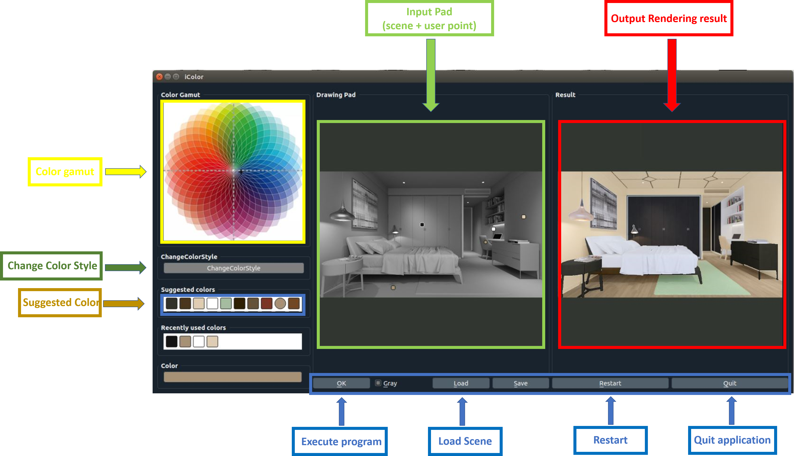

# Interactive-Design-and-Preview-of-Colored-Snapshots-of-Indoor-Scenes


We first describe the system <b>(0) Prerequisities</b> and steps for <b>(1) Getting started</b>. We then describe the interactive colorization demo <b>(2) Interactive Colorization </b>. There are two demos: (a) 说明 (b) 演示


### (0) Prerequisites
- Linux or OSX
- PyTorch
- CPU or NVIDIA GPU + CUDA CuDNN.

### (1) Getting Started
- Clone this repo:
```bash
git clone git@github.com:liubai20609/Interactive-Design-and-Preview-of-Colored-Snapshots-of-Indoor-Scenes-1.git
```

- Download the reference model
```
Please refer to https://github.com/junyanz/interactive-deep-colorization
```

- Run the UI: `python ideepcolor.py`. 
```


- User interactions



- <b>Adding points</b>: Left-click somewhere on the input pad
- <b>Moving points</b>: Left-click and hold on a point on the input pad, drag to desired location, and let go
- <b>Changing colors</b>: For currently selected point, choose a recommended color (middle-left) or choose a color on the ab color gamut (top-left)
- <b>Removing points</b>: Right-click on a point on the input pad
- <b>Changing patch size</b>: Mouse wheel changes the patch size from 1x1 to 9x9
- <b>Load image</b>: Click the load image button and choose desired image
- <b>Restart</b>: Click on the restart button. All points on the pad will be removed.
- <b>Save result</b>: Click on the save button. This will save the resulting colorization in a directory where the ```image_file``` was, along with the user input ab values.
- <b>Quit</b>: Click on the quit button.


### Installation
- Install Caffe or PyTorch. The Caffe model is official. PyTorch is a reimplementation.

  - Install Caffe: see the Caffe [installation](http://caffe.berkeleyvision.org/installation.html) and Ubuntu installation [document](http://caffe.berkeleyvision.org/install_apt.html). Please compile the Caffe with the python layer [support](https://chrischoy.github.io/research/caffe-python-layer/) (set `WITH_PYTHON_LAYER=1` in the `Makefile.config`) and build Caffe python library by `make pycaffe`.

  You also need to add `pycaffe` to your `PYTHONPATH`. Use `vi ~/.bashrc` to edit the environment variables.
  ```bash
  PYTHONPATH=/path/to/caffe/python:$PYTHONPATH
  LD_LIBRARY_PATH=/path/to/caffe/build/lib:$LD_LIBRARY_PATH
  ```


```
